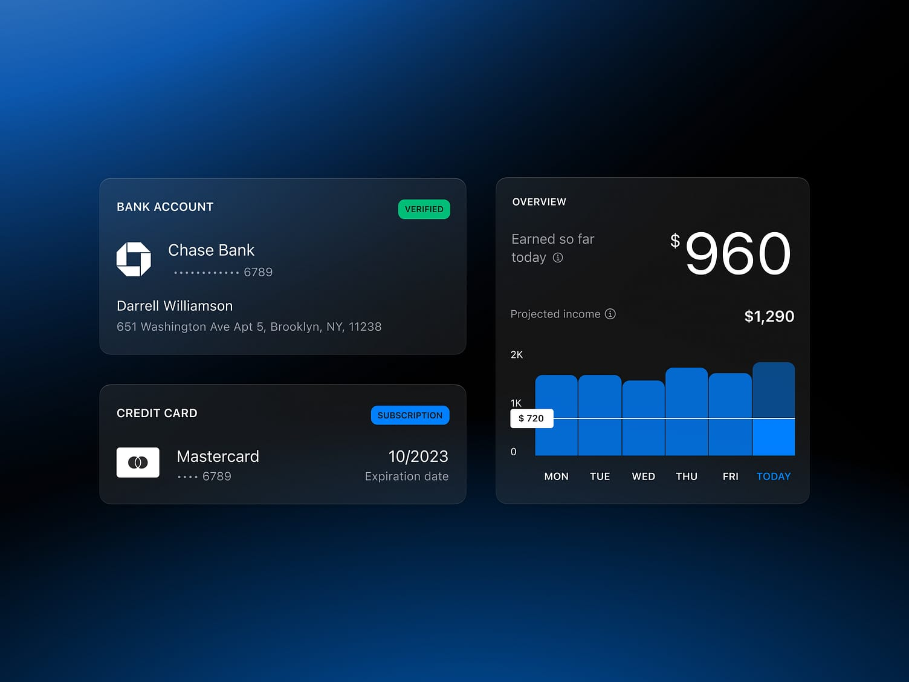
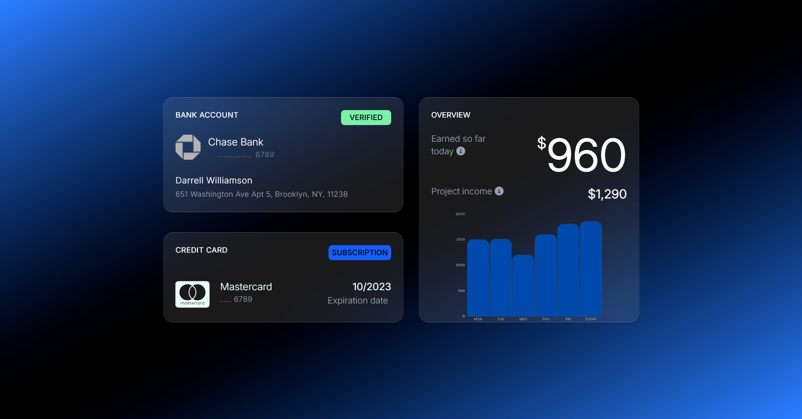

# USC-KIIT-ASSESSMENT-2

## 📸 Project Description

This project is a recreation of the following UI reference given below. It was built using **pure HTML** and **TailwindCSS utility classes** — without any external CSS.

## 🛠️ Built With

- **HTML**
- **TailwindCSS** (via `output.css`)
- **Font Awesome** for icons

## 💻 OUTPUT

